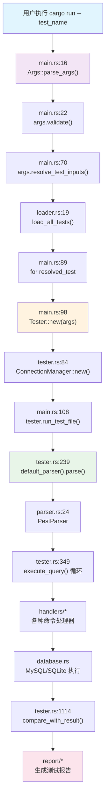

[](https://deepwiki.com/WSL0809/dingo_test_runner)
# MySQL Test Runner (Rust)

一个用 Rust 实现的 MySQL 测试运行器，支持解析执行 `.test` 文件、结果比对、并发执行和多种报告格式。

## 项目特色

- **MySQL 测试格式兼容** 支持 50+ 种查询类型和指令
- **扩展语法支持** 新增 4 种语法特性：
  - 控制流内省略 `--` 前缀
  - 变量自增/自减操作 (`inc $var`, `dec $var`)
  - 批量操作 (`batch_insert`, `batch_execute`, `end_batch`)
  - 事务管理简化 (`begin_transaction`, `commit_transaction`)
- **Pest 语法解析器** 基于 Pest 库的解析器实现
- **文件级并发** 支持多个测试文件并行执行
- **查询级并发** 支持 `--begin_concurrent` / `--end_concurrent` 并发块
- **多数据库支持** MySQL 8.0 + SQLite 本地调试
- **多种报告格式** Terminal 彩色输出、HTML、JUnit XML、Allure 报告
- **变量系统** 支持 `--let` 变量定义、表达式求值、SQL 反引号表达式
- **控制流** 支持 `if` / `while` 条件循环语句

## 架构概览

系统采用分层架构，从命令行解析到测试执行，再到报告生成：

```
CLI 层 (cli.rs)          → 解析命令行参数，支持多种输入格式
  ↓
加载层 (loader.rs)       → 发现和加载 .test 文件
  ↓  
解析层 (parser.rs)       → Pest 语法解析器
  ↓
执行层 (tester.rs)       → 测试执行引擎，串行+并发执行
  ↓
数据库层 (database.rs)   → MySQL/SQLite 抽象，连接管理
  ↓
报告层 (report/)         → 多格式报告：Terminal/HTML/XML/Allure
```

### 核心数据流



## 快速开始

### 环境要求

- **Rust** ≥ 1.78 (推荐使用 `rustup` 安装)
- **MySQL** 8.0

### 安装构建

```bash
# 克隆仓库
git clone <repository-url>
cd dingo_test_runner

# 构建项目
cargo build --release
```

### 基本使用

```bash
# 运行单个测试 (自动查找 t/basic.test)
cargo run -- basic

# 运行 .test 文件
cargo run -- basic.test

# 运行目录下所有测试
cargo run -- t/demo_tests

# 运行所有测试
cargo run -- --all

# 指定数据库连接
cargo run -- --host 127.0.0.1 --port 3306 --user root --passwd password basic

# 文件级并发执行
cargo run -- --parallel 4 test1 test2 test3 test4
```

### Record 模式 vs 比对模式

```bash
# Record 模式：生成期望结果文件 (r/basic.result)
cargo run -- --record basic

# 比对模式：与期望结果比对 (默认)
cargo run -- basic

# 自定义结果目录
cargo run -- --record --result-dir results basic    # 生成 results/basic.result
cargo run -- --result-dir results basic             # 比对 results/basic.result
```

## 目录结构与职责

```
src/
├── main.rs                    # 程序入口，调度测试执行 (289行)
├── cli.rs                     # 命令行参数解析，支持多种输入格式 (613行)
├── loader.rs                  # 测试文件发现和加载 (150行)
├── lib.rs                     # 库入口模块 (11行)
├── tester/                    # 测试执行模块
│   ├── tester.rs              # 测试执行引擎，串行+并发 (2014行)
│   ├── parser.rs              # 解析器抽象层和工厂函数 (89行)
│   ├── pest_parser.rs         # Pest 语法解析器 (486行)
│   ├── mysql_test.pest        # Pest 语法定义文件 (61行)
│   ├── query.rs               # Query 结构和 48 种查询类型定义
│   ├── database.rs            # MySQL/SQLite 数据库抽象层
│   ├── connection_manager.rs  # 多连接池管理
│   ├── variables.rs           # 变量系统：let 语句和变量展开
│   ├── expression.rs          # 表达式求值器
│   ├── error_handler.rs       # MySQL 错误码处理
│   ├── registry.rs            # 命令注册表
│   └── handlers/              # 各种命令处理器
├── report/                    # 报告生成系统
│   ├── mod.rs                 # ReportRenderer trait 抽象
│   ├── summary.rs             # 终端彩色输出
│   ├── html.rs                # HTML 报告生成
│   ├── xunit.rs               # JUnit XML 报告
│   └── allure.rs              # Allure 报告
├── util/                      # 工具模块
│   ├── regex.rs               # 正则表达式工具
│   └── error_utils.rs         # 错误处理工具
└── stub/                      # 桩代码
    └── email.rs               # 邮件通知功能
```

## 执行链路详解

### 1. 命令行解析 (`cli.rs`)

```rust
// src/cli.rs:14-30
#[derive(Parser, Debug, Clone)]
pub struct Args {
    #[arg(long, default_value = "127.0.0.1")]
    pub host: String,
    #[arg(long, default_value = "3306")]  
    pub port: String,
    #[arg(long, default_value = "root")]
    pub user: String,
    // ... 更多参数
}
```

**支持的输入格式** (`cli.rs:211-360`)：
- 测试名称：`basic` → 查找 `t/basic.test`
- 文件名：`basic.test` → 查找 `t/basic.test`
- 目录：`t/demo_tests` → 运行目录下所有 `.test` 文件
- 路径：`path/to/test.test` → 直接使用该路径
- 部分匹配：`user` → 匹配所有包含 "user" 的测试

### 2. 测试文件加载 (`loader.rs`)

```rust
// src/loader.rs:19-48
pub fn load_all_tests() -> Result<Vec<String>> {
    let mut tests = Vec::new();
    let test_dir = Path::new("t");
    
    for entry in WalkDir::new(test_dir)
        .into_iter()
        .filter_map(Result::ok)
        .filter(|e| !e.file_type().is_dir())
    {
        let path = entry.path();
        if path.extension().map_or(false, |ext| ext == "test") {
            // 递归发现所有 .test 文件
        }
    }
}
```

### 3. 测试执行器创建 (`tester.rs`)

```rust
// src/tester/tester.rs:70-103
impl Tester {
    pub fn new(args: Args) -> Result<Self> {
        let connection_info = ConnectionInfo {
            host: args.host.clone(),
            port: args.port.parse()?,
            user: args.user.clone(),
            password: args.passwd.clone(),
            // ...
        };
        
        let connection_manager = ConnectionManager::new(
            connection_info, 
            args.retry_conn_count as u32
        )?;
        
        // 初始化测试执行器
    }
}
```

## Tester 核心系统

### 测试执行流程

```rust
// src/tester/tester.rs:228-348
pub fn run_test_file<P: AsRef<Path>>(&mut self, test_file: P) -> Result<TestResult> {
    // 1. 设置测试环境
    self.set_test(&test_name)?;
    
    // 2. 解析测试文件
    let content = fs::read_to_string(&test_file_path)?;
    let mut parser = default_parser();
    let queries = parser.parse(&content)?;
    
    // 3. 构建控制流映射
    self.build_control_flow_map(&queries)?;
    
    // 4. 执行查询序列
    for (i, query) in queries.iter().enumerate() {
        self.execute_query(query, i)?;
    }
    
    // 5. 生成测试结果
    let result = self.build_test_result(&test_name, start_time);
}
```

### 并发执行机制

```rust
// src/tester/tester.rs:1580-1731
fn execute_concurrent_queries(&mut self) -> Result<()> {
    let results: Arc<Mutex<Vec<(usize, String)>>> = Arc::new(Mutex::new(Vec::new()));
    
    // 使用 rayon 并行执行查询
    self.concurrent_queries
        .par_iter()
        .enumerate()
        .try_for_each(|(index, query)| {
            // 每个线程使用独立的数据库连接
            let mut conn = self.connection_manager.get_connection()?;
            
            // 执行查询并收集结果
            let output = self.execute_single_query(&mut conn, query)?;
            results.lock().unwrap().push((index, output));
        })?;
    
    // 按原始顺序排序结果
    results.sort_by_key(|&(index, _)| index);
}
```

### 变量系统

```rust
// src/tester/variables.rs:20-89
pub struct VariableContext {
    variables: HashMap<String, String>,
}

impl VariableContext {
    pub fn expand_variables(&self, input: &str) -> String {
        let mut result = input.to_string();
        
        // 展开 $var 格式变量
        for (name, value) in &self.variables {
            let pattern = format!("${}", name);
            result = result.replace(&pattern, value);
        }
        
        result
    }
}
```

## Parser 解析系统

### Pest 解析器架构

```rust
// src/tester/parser.rs:10-35
pub trait QueryParser: Send + Sync {
    fn parse(&mut self, content: &str) -> Result<Vec<Query>>;
}

/// Factory function to create the default parser implementation
pub fn default_parser() -> Box<dyn QueryParser> {
    Box::new(crate::tester::pest_parser::PestParser::new())
}
```

### Pest 语法定义

```pest
// src/tester/mysql_test.pest:1-61
test_file = { SOI ~ line* ~ EOI }

line = _{ 
    empty_line |
    comment |
    command |
    delimiter_change |
    control_flow |
    let_stmt |
    sql_statement
}

// 注释：# 开头
comment = { "#" ~ comment_text ~ NEWLINE? }

// 命令：-- 开头
command = { "--" ~ command_content ~ NEWLINE? }

// 控制流：if/while/end
if_stmt = { "if" ~ WHITESPACE* ~ "(" ~ condition ~ ")" ~ NEWLINE? }
while_stmt = { "while" ~ WHITESPACE* ~ "(" ~ condition ~ ")" ~ NEWLINE? }
end_stmt = { "end" ~ NEWLINE? }

// Let 语句：大小写不敏感
let_stmt = { ^"let" ~ WHITESPACE* ~ let_assignment ~ NEWLINE? }
```

### 支持的查询类型

系统支持 50+ 种查询类型，定义在 `src/tester/query.rs`：

| 类别 | 指令 | 功能 | 处理器 |
|------|------|------|--------|
| **基础查询** | `Query` | SQL 查询执行 | `handlers/mod.rs` |
| **输出控制** | `--echo` / `echo` | 输出文本 | `handlers/echo.rs` |
| **错误处理** | `--error` / `error` | 预期错误捕获 | `handlers/error.rs` |
| **变量系统** | `--let` / `let` | 变量定义 | `handlers/let_handler.rs` |
| **变量操作** | `inc` / `dec` | 变量自增/自减 | `handlers/var_operations.rs` |
| **变量运算** | `add` / `sub` | 变量加法/减法 | `handlers/var_operations.rs` |
| **控制流** | `if/while/end` | 条件循环 | `tester.rs:1502-1579` |
| **批量操作** | `batch_insert` / `batch_execute` / `end_batch` | 批量SQL执行 | `handlers/batch_operations.rs` |
| **事务管理** | `begin_transaction` / `commit_transaction` / `rollback_transaction` | 事务控制 | `handlers/transaction_operations.rs` |
| **并发执行** | `--begin_concurrent` | 并发块开始 | `tester.rs:1580-1731` |
| **连接管理** | `--connect` | 多连接管理 | `handlers/connect.rs` |
| **结果处理** | `--sorted_result` / `sorted_result` | 结果排序 | `handlers/sorted_result.rs` |
| **正则替换** | `--replace_regex` | 结果替换 | `handlers/replace_regex.rs` |
| **外部命令** | `--exec` | 系统命令执行 | `handlers/exec.rs` |

## 报告系统

### 多格式报告架构

```rust
// src/report/mod.rs:15-25
pub trait ReportRenderer {
    fn render(&self, suite: &TestSuiteResult) -> Result<String>;
}

pub fn create_renderer(format: &str) -> Result<Box<dyn ReportRenderer>> {
    match format.to_lowercase().as_str() {
        "terminal" | "console" => Ok(Box::new(TerminalRenderer::new())),
        "html" => Ok(Box::new(HtmlRenderer::new())),
        "plain" => Ok(Box::new(PlainTextRenderer::new())),
        "xunit" => Ok(Box::new(XunitRenderer::new())),
        "allure" => Ok(Box::new(AllureRenderer::new())),
        _ => Err(anyhow!("Unsupported report format: {}", format)),
    }
}
```

### 报告格式对比

| 格式 | 用途 | 特点 |
|------|------|------|
| **Terminal** | 开发调试 | 彩色输出，实时反馈 |
| **HTML** | 网页查看 | 响应式设计，美观易读 |
| **JUnit XML** | CI/CD 集成 | 标准格式，工具兼容 |
| **Allure** | 企业级报告 | 丰富图表，历史趋势 |
| **Plain Text** | 脚本处理 | 纯文本，易于解析 |

## 命令行参数

### 数据库连接
```bash
--host <host>          # 数据库主机 (默认: 127.0.0.1)
--port <port>          # 数据库端口 (默认: 3306)
--user <user>          # 用户名 (默认: root)
--passwd <password>    # 密码 (默认: 123456)
```

### 测试选项
```bash
--record               # 启用 Record 模式
--all                  # 运行所有测试
--log-level <level>    # 日志级别 (error/warn/info/debug/trace)
--fail-fast <bool>     # 遇到错误立即停止 (默认: true)
--parallel <N>         # 文件级并发执行线程数 (默认: 1)
--max-connections <N>  # 数据库连接池大小 (默认: 0，自动计算)
--result-dir <dir>     # 自定义结果目录路径 (默认: "r")
```

### 报告输出
```bash
--report-format <fmt>  # 报告格式 (terminal/html/plain/xunit/allure)
--xunit-file <file>    # JUnit XML 报告文件
--allure-dir <dir>     # Allure 报告目录
```

### 邮件通知
```bash
--email-enable               # 启用邮件通知
--email-smtp-host <server>   # SMTP 服务器
--email-smtp-port <port>     # SMTP 端口
--email-username <user>      # 邮箱用户名
--email-password <password>  # 邮箱密码
--email-from <email>         # 发件人邮箱
--email-to <emails>          # 收件人邮箱(逗号分隔)
--email-enable-tls           # 启用TLS连接
```

## 测试文件格式

### 基本语法

```sql
# 注释
--echo 输出文本

# SQL 查询
SELECT 1;

# 多行查询
SELECT * 
FROM users 
WHERE id = 1;

# 变量定义和使用
--let $user_id = 1
SELECT * FROM users WHERE id = $user_id;

# 控制流
--let $count = 5
if ($count > 0)
  SELECT 'positive';
end

# 并发执行
--begin_concurrent
SELECT 1;
SELECT 2;
--end_concurrent
```

### 支持的指令

| 类别 | 指令 | 语法 | 功能 |
|------|------|------|------|
| **基础控制** | `--echo` / `echo` | `--echo <text>` / `echo <text>` | 输出文本 |
| | `--error` / `error` | `--error <code>` / `error <code>` | 预期错误码 |
| | `--sleep` / `sleep` | `--sleep <seconds>` / `sleep <seconds>` | 暂停执行 |
| **变量系统** | `--let` / `let` | `--let $var = value` / `let $var = value` | 变量定义 |
| | `inc` | `inc $var` | 变量自增 |
| | `dec` | `dec $var` | 变量自减 |
| | `add` | `add $var, <value>` | 变量加法 |
| | `sub` | `sub $var, <value>` | 变量减法 |
| **批量操作** | `batch_insert` | `batch_insert <table>` | 开始批量插入 |
| | `batch_execute` | `batch_execute` | 开始批量执行模式 |
| | `end_batch` | `end_batch` | 结束批量操作 |
| **事务控制** | `begin_transaction` | `begin_transaction` | 开始事务 |
| | `commit_transaction` | `commit_transaction` | 提交事务 |
| | `rollback_transaction` | `rollback_transaction` | 回滚事务 |
| **结果处理** | `--sorted_result` / `sorted_result` | `--sorted_result` / `sorted_result` | 结果排序 |
| | `--replace_regex` | `--replace_regex /<regex>/<replacement>/` | 正则替换 |
| **文件操作** | `--source` / `source` | `--source <file>` / `source <file>` | 包含其他测试文件 |
| | `--exec` | `--exec <command>` | 执行系统命令 |
| **连接管理** | `--connect` | `--connect (name,host,user,password,db)` | 连接管理 |

## 使用示例

### 基础测试

```sql
# t/basic.test
--echo 开始基础测试

CREATE TABLE users (
    id INTEGER PRIMARY KEY AUTO_INCREMENT,
    name VARCHAR(100) NOT NULL
);

INSERT INTO users (name) VALUES ('Alice'), ('Bob');

--echo 查询所有用户：
SELECT * FROM users ORDER BY id;

DROP TABLE users;
--echo 基础测试完成
```

运行：
```bash
# 生成期望结果
cargo run -- --record basic

# 验证测试
cargo run -- basic
```

### 变量和表达式

```sql
# t/variables.test
--echo 变量系统测试

--let $user_count = 5
--let $table_name = test_users
--let $result = $user_count * 2

--echo 用户数量: $user_count
--echo 表名: $table_name  
--echo 计算结果: $result

# SQL 反引号表达式
--let $row_count = `SELECT COUNT(*) FROM information_schema.tables`
--echo 系统表数量: $row_count

CREATE TABLE $table_name (id INT, name VARCHAR(50));
INSERT INTO $table_name VALUES (1, 'User1');
SELECT * FROM $table_name;
DROP TABLE $table_name;
```

### 控制流

```sql
# t/control_flow.test
--echo 控制流测试

--let $count = 3
--let $i = 1

while ($i <= $count)
  --echo 循环第 $i 次
  SELECT $i as iteration;
  inc $i
end

if ($count > 2)
  --echo 数量大于2
  SELECT 'Large count' as result;
end
```

### 并发执行

```sql
# t/concurrent.test
--echo 并发执行测试

CREATE TABLE concurrent_test (id INT, value VARCHAR(50));

--begin_concurrent
INSERT INTO concurrent_test VALUES (1, 'Thread1');
INSERT INTO concurrent_test VALUES (2, 'Thread2');
INSERT INTO concurrent_test VALUES (3, 'Thread3');
--end_concurrent

--sorted_result
SELECT * FROM concurrent_test;

DROP TABLE concurrent_test;
```

### 增强语法示例

```sql
# t/enhanced_syntax.test
--echo 增强语法特性测试

# 变量操作
--let $counter = 0
--let $total = 100

--echo 初始计数器: $counter
inc $counter
--echo 自增后: $counter

add $counter, 5
--echo 加法后: $counter

dec $total
--echo 减法后: $total

# 批量操作
CREATE TABLE batch_test (id INT, name VARCHAR(50));

batch_insert batch_test
(1, 'Item1')
(2, 'Item2')
(3, 'Item3')
end_batch

--echo 批量插入完成
SELECT * FROM batch_test;

# 事务管理
begin_transaction

UPDATE batch_test SET name = 'Modified' WHERE id = 1;
--echo 事务中修改数据

if ($counter > 5)
  commit_transaction
  --echo 事务已提交
end

DROP TABLE batch_test;
```

## 开发和调试

### 日志调试

```bash
# 启用详细日志
RUST_LOG=debug cargo run -- basic

# 启用追踪日志
RUST_LOG=trace cargo run -- basic
```

### 解析器调试

```bash
# 使用 Pest 解析器
cargo run -- basic

# 启用详细的解析日志
RUST_LOG=dingo_test_runner::tester::pest_parser=debug cargo run -- basic
```

## 常用命令快速操作手册

### 基础测试命令

```bash
# 基本测试执行
cargo run -- basic_test                                    # 运行单个测试
cargo run -- t/examples/basic_example.test                 # 运行指定文件
cargo run -- t/demo_tests/                                 # 运行目录下所有测试
cargo run -- --all                                         # 运行所有测试

# Record模式（生成期望结果）
cargo run -- --record basic_test                           # 记录单个测试结果
cargo run -- --record t/examples/                          # 记录目录下所有测试
```

### 数据库连接命令

```bash
# 标准MySQL连接
cargo run -- --host 127.0.0.1 --port 3306 --user root --passwd 123456 basic_test

# 本地开发环境连接
export DB_PASSWORD="123456"
cargo run -- --host 127.0.0.1 --port 3306 --user root --passwd $DB_PASSWORD basic_test

```

### 并发执行命令

```bash
# 文件级并发执行
cargo run -- --parallel 4 test1 test2 test3 test4         # 4线程并发
cargo run -- --parallel 8 t/examples/                     # 8线程运行目录
cargo run -- --parallel 2 --all                           # 2线程运行所有测试

# 配置连接池
cargo run -- --parallel 4 --max-connections 8 t/demo_tests/
```

### 报告生成命令

```bash
# 终端彩色输出（默认）
cargo run -- --report-format terminal basic_test

# HTML报告
cargo run -- --report-format html basic_test > report.html

# JUnit XML报告（CI/CD集成）
cargo run -- --report-format xunit --xunit-file report.xml basic_test

# Allure报告
cargo run -- --report-format allure --allure-dir ./allure-results basic_test

# 纯文本报告（脚本处理）
cargo run -- --report-format plain basic_test > report.txt
```

### 环境隔离命令

```bash
# 开发环境测试
cargo run -- --extension dev --record basic_test           # 生成开发环境基线
cargo run -- --extension dev basic_test                    # 开发环境验证

# 集成测试环境
cargo run -- --extension integration --record tests/integration/
cargo run -- --extension integration tests/integration/

# CI环境测试
cargo run -- --extension ci --record t/examples/
cargo run -- --extension ci t/examples/

# 数据库版本环境
cargo run -- --extension mysql8 --record basic_test
cargo run -- --extension mysql57 basic_test

# 自定义结果目录 + 环境隔离
cargo run -- --result-dir dev_results --extension dev --record basic_test
cargo run -- --result-dir ci_results --extension ci t/examples/
```

### 开发调试命令

```bash
# 详细日志调试
RUST_LOG=debug cargo run -- basic_test                     # 调试级别日志
RUST_LOG=trace cargo run -- basic_test                     # 追踪级别日志
RUST_LOG=dingo_test_runner::tester::pest_parser=debug cargo run -- basic_test

# 构建和测试
cargo build                                                 # 标准构建
cargo build --release                                       # 发布构建
cargo test                                                  # 运行Rust单元测试

# 性能分析（需要cargo-flamegraph）
cargo install flamegraph
sudo cargo flamegraph --bin dingo_test_runner -- --parallel 4 t/examples/
```

### 邮件通知命令

```bash
# 设置邮件环境变量
export EMAIL_PASSWORD="your_email_password"
export SMTP_HOST="smtp.partner.outlook.cn"
export EMAIL_FROM="test@company.com"
export EMAIL_TO="admin@company.com"

# 邮件通知测试
cargo run -- --email-enable \
  --email-smtp-host $SMTP_HOST \
  --email-smtp-port 587 \
  --email-username $EMAIL_FROM \
  --email-password $EMAIL_PASSWORD \
  --email-from $EMAIL_FROM \
  --email-to $EMAIL_TO \
  --email-enable-tls \
  basic_test
```

### 故障排查命令

```bash
# 单步调试模式
cargo run -- --fail-fast true basic_test                   # 遇错即停
cargo run -- --fail-fast false basic_test                  # 继续执行

# 连接测试
cargo run -- --host 127.0.0.1 --port 3306 --user root --passwd 123456 \
  --max-connections 1 simple_connection_test
```

### 批处理脚本示例

```bash
# 一键开发测试脚本 (dev_test.sh)
#!/bin/bash
export EMAIL_PASSWORD="your_password"
export DB_PASSWORD="123456"

# 运行开发环境全量测试
cargo run -- --extension dev --parallel 4 \
  --host 127.0.0.1 --port 3306 --user root --passwd $DB_PASSWORD \
  --report-format html \
  tests/integration/ > dev_report.html

echo "开发测试完成，报告已生成: dev_report.html"

# 一键生产验证脚本 (prod_test.sh)
#!/bin/bash
export EMAIL_PASSWORD="your_password"
export DB_PASSWORD="production_password"

# 生产环境测试并发送邮件
cargo run -- --extension prod --parallel 2 \
  --host production-db --port 3306 --user testuser --passwd $DB_PASSWORD \
  --report-format allure --allure-dir ./allure-results \
  --email-enable --email-smtp-host smtp.company.com \
  --email-password $EMAIL_PASSWORD \
  t/examples/

echo "生产验证完成，Allure报告已生成，邮件已发送"
```
