[](https://deepwiki.com/WSL0809/dingo_test_runner)
# MySQL Test Runner (Rust)

一个兼容 MySQL 官方测试格式的测试运行器，用 Rust 重写，支持解析执行 `.test` 文件、结果比对、并发执行和多种报告格式。

## 🎯 项目特色

- **完全兼容** MySQL 官方测试格式，支持 48 种查询类型和指令
- **双解析器架构** 基于 Pest 语法解析器 + 手写解析器备选方案
- **并发执行** 支持 `--BEGIN_CONCURRENT` / `--END_CONCURRENT` 并发块
- **多数据库支持** MySQL 8.0 + SQLite 本地调试
- **丰富报告** Terminal 彩色输出、HTML、JUnit XML、Allure 企业级报告
- **变量系统** 支持 `--let` 变量定义、表达式求值、SQL 反引号表达式
- **控制流** 支持 `if` / `while` 条件循环语句

## 📊 架构概览

系统采用分层架构，从命令行解析到测试执行，再到报告生成：

```
CLI 层 (cli.rs)          → 解析命令行参数，支持多种输入格式
  ↓
加载层 (loader.rs)       → 发现和加载 .test 文件
  ↓  
解析层 (parser.rs)       → 双解析器：Pest + 手写解析器
  ↓
执行层 (tester.rs)       → 核心测试引擎，串行+并发执行
  ↓
数据库层 (database.rs)   → MySQL/SQLite 抽象，连接管理
  ↓
报告层 (report/)         → 多格式报告：Terminal/HTML/XML/Allure
```

### 核心数据流

```mermaid
graph TD
    A["用户执行 cargo run -- test_name"] --> B["main.rs:16<br/>Args::parse_args()"]
    B --> C["main.rs:22<br/>args.validate()"]
    C --> D["main.rs:70<br/>args.resolve_test_inputs()"]
    D --> E["loader.rs:19<br/>load_all_tests()"]
    E --> F["main.rs:89<br/>for resolved_test"]
    F --> G["main.rs:98<br/>Tester::new(args)"]
    G --> H["tester.rs:84<br/>ConnectionManager::new()"]
    H --> I["main.rs:108<br/>tester.run_test_file()"]
    I --> J["tester.rs:239<br/>default_parser().parse()"]
    J --> K["parser.rs:24<br/>PestParser 或 HandwrittenParser"]
    K --> L["tester.rs:349<br/>execute_query() 循环"]
    L --> M["handlers/*<br/>各种命令处理器"]
    M --> N["database.rs<br/>MySQL/SQLite 执行"]
    N --> O["tester.rs:1114<br/>compare_with_result()"]
    O --> P["report/*<br/>生成测试报告"]
    
    style A fill:#e1f5fe
    style B fill:#f3e5f5
    style G fill:#fff3e0
    style J fill:#e8f5e8
    style P fill:#fce4ec
```



## 🚀 快速开始

### 环境要求

- **Rust** ≥ 1.78 (推荐使用 `rustup` 安装)
- **MySQL** 8.0 (可选，无 MySQL 时自动回落到 SQLite)

### 安装构建

```bash
# 克隆仓库
git clone <repository-url>
cd dingo_test_runner

# 构建项目
cargo build --release
```

### 基本使用

```bash
# 运行单个测试 (自动查找 t/basic.test)
cargo run -- basic

# 运行 .test 文件
cargo run -- basic.test

# 运行目录下所有测试
cargo run -- t/demo_tests

# 运行所有测试
cargo run -- --all

# 指定数据库连接
cargo run -- --host 127.0.0.1 --port 3306 --user root --passwd password basic
```

### Record 模式 vs 比对模式

```bash
# Record 模式：生成期望结果文件 (r/basic.result)
cargo run -- --record basic

# 比对模式：与期望结果比对 (默认)
cargo run -- basic
```

## 📁 目录结构与职责

```
src/
├── main.rs                    # 程序入口，调度测试执行 (289行)
├── cli.rs                     # 命令行参数解析，支持多种输入格式 (613行)
├── loader.rs                  # 测试文件发现和加载 (150行)
├── lib.rs                     # 库入口模块 (11行)
├── tester/                    # 🔥 核心测试执行模块
│   ├── tester.rs              # 测试执行引擎，串行+并发 (2014行)
│   ├── parser.rs              # 解析器抽象层和手写实现 (537行)
│   ├── pest_parser.rs         # Pest 语法解析器 (486行)
│   ├── mysql_test.pest        # Pest 语法定义文件 (61行)
│   ├── query.rs               # Query 结构和 48 种查询类型定义
│   ├── database.rs            # MySQL/SQLite 数据库抽象层
│   ├── connection_manager.rs  # 多连接池管理
│   ├── variables.rs           # 变量系统：let 语句和变量展开
│   ├── expression.rs          # 表达式求值器
│   ├── error_handler.rs       # MySQL 错误码处理
│   ├── registry.rs            # 命令注册表
│   └── handlers/              # 各种命令处理器
├── report/                    # 📊 报告生成系统
│   ├── mod.rs                 # ReportRenderer trait 抽象
│   ├── summary.rs             # 终端彩色输出
│   ├── html.rs                # HTML 报告生成
│   ├── xunit.rs               # JUnit XML 报告
│   └── allure.rs              # Allure 企业级报告
├── util/                      # 工具模块
│   ├── regex.rs               # 正则表达式工具
│   └── error_utils.rs         # 错误处理工具
└── stub/                      # 桩代码
    └── email.rs               # 邮件通知功能
```

## 🔧 执行链路详解

### 1. 命令行解析 (`cli.rs`)

```rust
// src/cli.rs:14-30
#[derive(Parser, Debug, Clone)]
pub struct Args {
    #[arg(long, default_value = "127.0.0.1")]
    pub host: String,
    #[arg(long, default_value = "3306")]  
    pub port: String,
    #[arg(long, default_value = "root")]
    pub user: String,
    // ... 更多参数
}
```

**支持的输入格式** (`cli.rs:211-360`)：
- 测试名称：`basic` → 查找 `t/basic.test`
- 文件名：`basic.test` → 查找 `t/basic.test`
- 目录：`t/demo_tests` → 运行目录下所有 `.test` 文件
- 路径：`path/to/test.test` → 直接使用该路径
- 部分匹配：`user` → 匹配所有包含 "user" 的测试

### 2. 测试文件加载 (`loader.rs`)

```rust
// src/loader.rs:19-48
pub fn load_all_tests() -> Result<Vec<String>> {
    let mut tests = Vec::new();
    let test_dir = Path::new("t");
    
    for entry in WalkDir::new(test_dir)
        .into_iter()
        .filter_map(Result::ok)
        .filter(|e| !e.file_type().is_dir())
    {
        let path = entry.path();
        if path.extension().map_or(false, |ext| ext == "test") {
            // 递归发现所有 .test 文件
        }
    }
}
```

### 3. 测试执行器创建 (`tester.rs`)

```rust
// src/tester/tester.rs:70-103
impl Tester {
    pub fn new(args: Args) -> Result<Self> {
        let connection_info = ConnectionInfo {
            host: args.host.clone(),
            port: args.port.parse()?,
            user: args.user.clone(),
            password: args.passwd.clone(),
            // ...
        };
        
        let connection_manager = ConnectionManager::new(
            connection_info, 
            args.retry_conn_count as u32
        )?;
        
        // 初始化测试执行器
    }
}
```

## 🎯 Tester 核心系统

### 测试执行流程

```rust
// src/tester/tester.rs:228-348
pub fn run_test_file<P: AsRef<Path>>(&mut self, test_file: P) -> Result<TestResult> {
    // 1. 设置测试环境
    self.set_test(&test_name)?;
    
    // 2. 解析测试文件
    let content = fs::read_to_string(&test_file_path)?;
    let mut parser = default_parser();
    let queries = parser.parse(&content)?;
    
    // 3. 构建控制流映射
    self.build_control_flow_map(&queries)?;
    
    // 4. 执行查询序列
    for (i, query) in queries.iter().enumerate() {
        self.execute_query(query, i)?;
    }
    
    // 5. 生成测试结果
    let result = self.build_test_result(&test_name, start_time);
}
```

### 并发执行机制

```rust
// src/tester/tester.rs:1580-1731
fn execute_concurrent_queries(&mut self) -> Result<()> {
    let results: Arc<Mutex<Vec<(usize, String)>>> = Arc::new(Mutex::new(Vec::new()));
    
    // 使用 rayon 并行执行查询
    self.concurrent_queries
        .par_iter()
        .enumerate()
        .try_for_each(|(index, query)| {
            // 每个线程使用独立的数据库连接
            let mut conn = self.connection_manager.get_connection()?;
            
            // 执行查询并收集结果
            let output = self.execute_single_query(&mut conn, query)?;
            results.lock().unwrap().push((index, output));
        })?;
    
    // 按原始顺序排序结果
    results.sort_by_key(|&(index, _)| index);
}
```

### 变量系统

```rust
// src/tester/variables.rs:20-89
pub struct VariableContext {
    variables: HashMap<String, String>,
}

impl VariableContext {
    pub fn expand_variables(&self, input: &str) -> String {
        let mut result = input.to_string();
        
        // 展开 $var 格式变量
        for (name, value) in &self.variables {
            let pattern = format!("${}", name);
            result = result.replace(&pattern, value);
        }
        
        result
    }
}
```

## 🔍 Parser 解析系统

### 双解析器架构

```rust
// src/tester/parser.rs:10-35
pub trait QueryParser: Send + Sync {
    fn parse(&mut self, content: &str) -> Result<Vec<Query>>;
}

pub fn default_parser() -> Box<dyn QueryParser> {
    #[cfg(feature = "pest")]
    {
        Box::new(crate::tester::pest_parser::PestParser::new())
    }
    #[cfg(not(feature = "pest"))]
    {
        Box::new(HandwrittenParser::new())
    }
}
```

### Pest 语法定义

```pest
// src/tester/mysql_test.pest:1-61
test_file = { SOI ~ line* ~ EOI }

line = _{ 
    empty_line |
    comment |
    command |
    delimiter_change |
    control_flow |
    let_stmt |
    sql_statement
}

// 注释：# 开头
comment = { "#" ~ comment_text ~ NEWLINE? }

// 命令：-- 开头
command = { "--" ~ command_content ~ NEWLINE? }

// 控制流：if/while/end
if_stmt = { "if" ~ WHITESPACE* ~ "(" ~ condition ~ ")" ~ WHITESPACE* ~ block_start? ~ NEWLINE? }
while_stmt = { "while" ~ WHITESPACE* ~ "(" ~ condition ~ ")" ~ WHITESPACE* ~ block_start? ~ NEWLINE? }

// Let 语句：大小写不敏感
let_stmt = { ^"let" ~ WHITESPACE* ~ let_assignment ~ NEWLINE? }
```

### 支持的查询类型

系统支持 48 种查询类型，定义在 `src/tester/query.rs`：

| 类别 | 指令 | 功能 | 处理器 |
|------|------|------|--------|
| **基础查询** | `Query` | SQL 查询执行 | `handlers/mod.rs` |
| **输出控制** | `--echo` | 输出文本 | `handlers/echo.rs` |
| **错误处理** | `--error` | 预期错误捕获 | `handlers/error.rs` |
| **变量系统** | `--let` | 变量定义 | `handlers/let_handler.rs` |
| **控制流** | `if/while/end` | 条件循环 | `tester.rs:1502-1579` |
| **并发执行** | `--begin_concurrent` | 并发块开始 | `tester.rs:1580-1731` |
| **连接管理** | `--connect` | 多连接管理 | `handlers/connect.rs` |
| **结果处理** | `--sorted_result` | 结果排序 | `handlers/sorted_result.rs` |
| **正则替换** | `--replace_regex` | 结果替换 | `handlers/replace_regex.rs` |
| **外部命令** | `--exec` | 系统命令执行 | `handlers/exec.rs` |

## 📊 报告系统

### 多格式报告架构

```rust
// src/report/mod.rs:15-25
pub trait ReportRenderer {
    fn render(&self, suite: &TestSuiteResult) -> Result<String>;
}

pub fn create_renderer(format: &str) -> Result<Box<dyn ReportRenderer>> {
    match format.to_lowercase().as_str() {
        "terminal" | "console" => Ok(Box::new(TerminalRenderer::new())),
        "html" => Ok(Box::new(HtmlRenderer::new())),
        "plain" => Ok(Box::new(PlainTextRenderer::new())),
        "xunit" => Ok(Box::new(XunitRenderer::new())),
        "allure" => Ok(Box::new(AllureRenderer::new())),
        _ => Err(anyhow!("Unsupported report format: {}", format)),
    }
}
```

### 报告格式对比

| 格式 | 用途 | 特点 |
|------|------|------|
| **Terminal** | 开发调试 | 彩色输出，实时反馈 |
| **HTML** | 网页查看 | 响应式设计，美观易读 |
| **JUnit XML** | CI/CD 集成 | 标准格式，工具兼容 |
| **Allure** | 企业级报告 | 丰富图表，历史趋势 |
| **Plain Text** | 脚本处理 | 纯文本，易于解析 |

## 🎛️ 命令行参数

### 数据库连接
```bash
--host <host>          # 数据库主机 (默认: 127.0.0.1)
--port <port>          # 数据库端口 (默认: 3306)
--user <user>          # 用户名 (默认: root)
--passwd <password>    # 密码 (默认: 123456)
```

### 测试选项
```bash
--record               # 启用 Record 模式
--all                  # 运行所有测试
--log-level <level>    # 日志级别 (error/warn/info/debug/trace)
--fail-fast <bool>     # 遇到错误立即停止 (默认: true)
```

### 报告输出
```bash
--report-format <fmt>  # 报告格式 (terminal/html/plain/xunit/allure)
--xunit-file <file>    # JUnit XML 报告文件
--allure-dir <dir>     # Allure 报告目录
```

### 邮件通知 (需要 `--features email`)
```bash
--email-smtp-server <server>    # SMTP 服务器
--email-smtp-port <port>        # SMTP 端口
--email-username <user>         # 邮箱用户名
--email-password <password>     # 邮箱密码
--email-from <email>            # 发件人邮箱
--email-to <emails>             # 收件人邮箱(逗号分隔)
--email-subject <subject>       # 邮件主题
```

## 🧪 测试文件格式

### 基本语法

```sql
# 注释
--echo 输出文本

# SQL 查询
SELECT 1;

# 多行查询
SELECT * 
FROM users 
WHERE id = 1;

# 变量定义和使用
let $user_id = 1
SELECT * FROM users WHERE id = $user_id;

# 控制流
let $count = 5
if ($count > 0)
  SELECT 'positive';
end

# 并发执行
--BEGIN_CONCURRENT
SELECT 1;
SELECT 2;
--END_CONCURRENT
```

### 支持的指令

| 指令 | 语法 | 功能 |
|------|------|------|
| `--echo` | `--echo <text>` | 输出文本 |
| `--error` | `--error <code>` | 预期错误码 |
| `--let` | `--let $var = value` | 变量定义 |
| `let` | `let $var = value` | 变量定义 (简化语法) |
| `--sorted_result` | `--sorted_result` | 结果排序 |
| `--replace_regex` | `--replace_regex /<regex>/<replacement>/` | 正则替换 |
| `--exec` | `--exec <command>` | 执行系统命令 |
| `--source` | `--source <file>` | 包含其他测试文件 |
| `--connect` | `--connect (name,host,user,password,db)` | 连接管理 |
| `--sleep` | `--sleep <seconds>` | 暂停执行 |

## 📈 使用示例

### 基础测试

```sql
# t/basic.test
--echo 开始基础测试

CREATE TABLE users (
    id INTEGER PRIMARY KEY AUTO_INCREMENT,
    name VARCHAR(100) NOT NULL
);

INSERT INTO users (name) VALUES ('Alice'), ('Bob');

--echo 查询所有用户：
SELECT * FROM users ORDER BY id;

DROP TABLE users;
--echo 基础测试完成
```

运行：
```bash
# 生成期望结果
cargo run -- --record basic

# 验证测试
cargo run -- basic
```

### 变量和表达式

```sql
# t/variables.test
--echo 变量系统测试

let $user_count = 5
let $table_name = test_users
let $result = $user_count * 2

--echo 用户数量: $user_count
--echo 表名: $table_name  
--echo 计算结果: $result

# SQL 反引号表达式
let $row_count = `SELECT COUNT(*) FROM information_schema.tables`
--echo 系统表数量: $row_count

CREATE TABLE $table_name (id INT, name VARCHAR(50));
INSERT INTO $table_name VALUES (1, 'User1');
SELECT * FROM $table_name;
DROP TABLE $table_name;
```

### 控制流

```sql
# t/control_flow.test
--echo 控制流测试

let $count = 3
let $i = 1

while ($i <= $count)
  --echo 循环第 $i 次
  SELECT $i as iteration;
  let $i = $i + 1
end

if ($count > 2)
  --echo 数量大于2
  SELECT 'Large count' as result;
end
```

### 并发执行

```sql
# t/concurrent.test
--echo 并发执行测试

CREATE TABLE concurrent_test (id INT, value VARCHAR(50));

--BEGIN_CONCURRENT
INSERT INTO concurrent_test VALUES (1, 'Thread1');
INSERT INTO concurrent_test VALUES (2, 'Thread2');
INSERT INTO concurrent_test VALUES (3, 'Thread3');
--END_CONCURRENT

--sorted_result
SELECT * FROM concurrent_test;

DROP TABLE concurrent_test;
```

## 🔧 开发和调试

### 日志调试

```bash
# 启用详细日志
RUST_LOG=debug cargo run -- basic

# 启用追踪日志
RUST_LOG=trace cargo run -- basic
```

### 解析器调试

```bash
# 使用手写解析器
cargo run --no-default-features -- basic

# 使用 Pest 解析器 (默认)
cargo run --features pest -- basic
```
